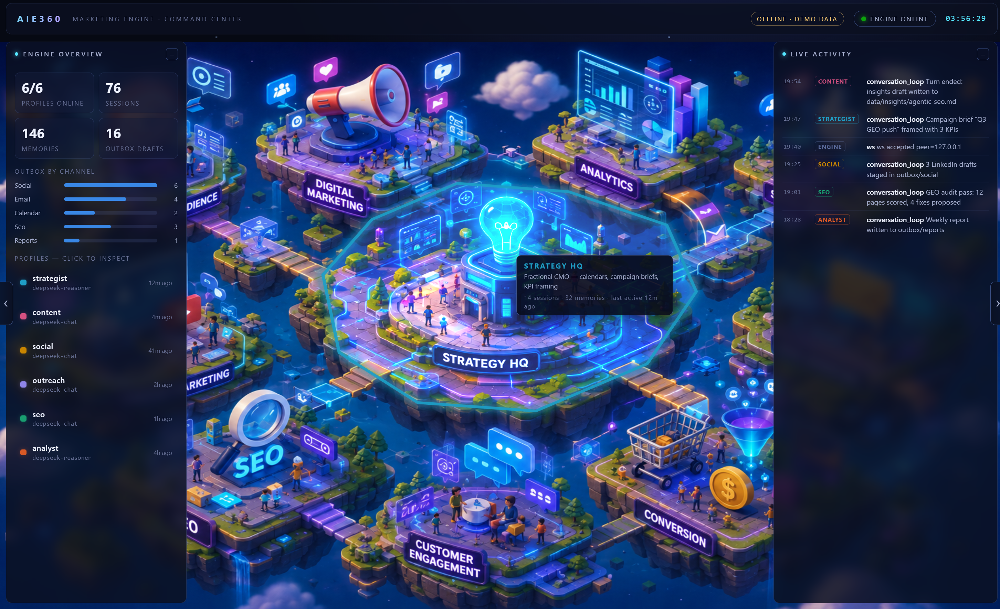

# AI Marketing Engine



Your AI marketing department, in a box: **31 capabilities** covering every
marketing need, **Opencode CLI** for anything that needs code built,
**everything-claude-code** as the agentic OS, and **n8n** for deterministic workflows —
all inside one Docker Compose stack with a guided setup UI.

Spin up a full-stack AI Engine that is designed to work with your organization,
connect to your systems, and driven by your people — a marketing team of strategy,
SEO, content, social, paid, email, creative, and analytics agents that plan, draft,
and (with your approval) ship, while every publish and every dollar stays behind a
human gate.

> This repo is a **template**. Clone it every time you want a new engine instance.

## Quickstart

```bash
git clone <this-repo> my-engine && cd my-engine
./scripts/new-instance.sh my-engine     # creates .env with generated secrets
docker compose up --build
```

Open **http://localhost:3000** → the setup wizard walks you through:

1. **Name** the instance and set a dashboard password
2. **Pick capabilities** (presets: Solo Creator / Startup / SMB / Enterprise, or custom)
3. **Brand intake** — answer a short questionnaire or just give your website URL
4. **Keys** — only the keys your enabled profiles need, validated live
5. **Goals, schedules, launch** — the engine flips to run mode

After setup you land on the **dashboard**: command bar (natural language → the right
profile), calendar, approvals queue, reports, profile manager, health.

## Architecture (short version)

| Piece                     | Role                                                                                                                                                                                                                    |
| ------------------------- | ----------------------------------------------------------------------------------------------------------------------------------------------------------------------------------------------------------------------- |
| `profiles/*.profile.md` | 31 capabilities as Hermes agent profiles. Frontmatter = manifest (tools, required keys, schedule); body = the agent's SOUL. Materialized into Hermes-native`HERMES_HOME` dirs at setup.                               |
| `ui/`                   | Next.js app: setup wizard + operations dashboard + engine API (`/api/run`, `/api/approvals`, …)                                                                                                                    |
| `workflows/*.json`      | n8n templates auto-imported at first boot: publish pipelines, lead intake, scheduler, pacing alerts, digests                                                                                                            |
| `os/`                   | Agentic-OS layer (everything-claude-code): binding rules, publish-gate & brand-lint hooks, skills. Materialized into every profile's`HERMES_HOME` (rules+hooks appended to `SOUL.md`, skills copied to `skills/`) |
| `contracts/`            | File contracts profiles communicate through: Brand Kit (incl. design system + tokens), Campaign Brief, Calendar, KPI Ledger, Knowledge Base                                                                             |
| `workspace/`            | **Your instance's data** (gitignored): brand kit, campaigns, content, reports, knowledge base (`knowledge/` + `INDEX.md`), audit log                                                                          |
| `.env`                  | The single place every key lives (`.env.example` documents all of them)                                                                                                                                               |

## The 31 profiles

Every marketing capability ships as one Hermes profile (`profiles/*.profile.md`). Each
carries its own persona, playbooks, tools, required keys, and output contracts. Profiles
are grouped into **tiers** so the setup wizard can offer sensible presets — enable only
the ones you need.

### Tier 0 — Foundation (always installed; everything else depends on them)

| # | Profile                | What it does                                                                                                                                                           |
| - | ---------------------- | ---------------------------------------------------------------------------------------------------------------------------------------------------------------------- |
| 1 | `brand-strategist`   | Builds and maintains the**Brand Kit** — mission, positioning, ICP personas, voice & tone, messaging hierarchy, visual guidelines. Every other profile reads it. |
| 2 | `market-researcher`  | Market sizing, competitor teardowns, pricing intel, trend monitoring, SWOT, voice-of-customer mining (reviews, forums, social listening).                              |
| 3 | `marketing-director` | The "CMO": turns goals into quarterly plans, allocates work to other profiles, owns the master campaign calendar, runs weekly retros against KPIs.                     |
| 4 | `analytics-engine`   | Connects GA4 / ad platforms / CRM, builds KPI dashboards, attribution analysis, anomaly alerts, and automated weekly/monthly reports.                                  |
| 5 | `compliance-guard`   | Reviews all outbound content for GDPR/CCPA, CAN-SPAM, FTC disclosure, ad-platform policy, and industry claims. Runs as a**hook** before any publish.             |

### Tier 1 — Core (the default preset; covers ~80% of orgs)

| #  | Profile                  | What it does                                                                                                                                             |
| -- | ------------------------ | -------------------------------------------------------------------------------------------------------------------------------------------------------- |
| 6  | `content-writer`       | Long-form content: blog posts, pillar pages, whitepapers, case studies, ebooks — brief → draft → SEO-optimized final. Maintains the content calendar. |
| 7  | `copywriter`           | Conversion copy: ad copy, landing-page copy, headlines, CTAs, product descriptions, script hooks. A/B variant generation.                                |
| 8  | `seo-engine`           | Keyword research, topical maps, content briefs, on-page optimization, technical audits, internal linking, rank tracking.                                 |
| 9  | `social-organic`       | Platform-native organic content (X, LinkedIn, Instagram, TikTok, Facebook, YouTube, Threads), content calendar, hashtag strategy, scheduling.            |
| 10 | `email-lifecycle`      | Newsletters, drip sequences, onboarding, win-back, cart abandonment; list hygiene; deliverability; ESP integration (Resend/SendGrid/Mailchimp/Klaviyo).  |
| 11 | `paid-search`          | Google/Bing Ads: campaign structure, keyword & negative lists, RSA copy, bid strategy, budget pacing, search-term audits.                                |
| 12 | `paid-social`          | Meta, LinkedIn, TikTok, X ads: audience strategy, creative briefs, campaign builds, budget pacing, creative-fatigue detection, ROAS reporting.           |
| 13 | `landing-page-builder` | Uses**Opencode CLI** to build/edit landing pages, embed tracking, ship A/B variants, and connect forms to CRM/ESP.                                 |
| 14 | `cro-optimizer`        | Funnel analysis, heuristic page audits, A/B test design & prioritization (ICE), result analysis, personalization recommendations.                        |
| 15 | `creative-designer`    | Image generation/editing for ads, social, blog headers, OG images; enforces visual brand guidelines; outputs every required ad size.                     |

### Tier 2 — Growth

| #  | Profile                    | What it does                                                                                                                              |
| -- | -------------------------- | ----------------------------------------------------------------------------------------------------------------------------------------- |
| 16 | `product-marketer`       | Launch plans, messaging docs, sales enablement (battlecards, one-pagers), pricing-page strategy, release announcement kits.               |
| 17 | `pr-communications`      | Press releases, media lists, journalist pitches, HARO/Connectively responses, crisis-comms playbooks, executive thought-leadership.       |
| 18 | `video-marketer`         | Scripts (YouTube, Shorts/Reels/TikTok), storyboards, hooks, thumbnail briefs, video SEO, repurposing long → short.                       |
| 19 | `lead-gen-crm`           | Lead-magnet strategy, form/funnel design, lead scoring, CRM hygiene, routing rules, MQL→SQL handoff (HubSpot/Salesforce/Pipedrive).      |
| 20 | `marketing-automation`   | Owns the n8n workflow library: designs cross-channel journeys, builds/deploys them via the n8n API (after approval), monitors run health. |
| 21 | `reputation-manager`     | Monitors G2/Capterra/Google/Trustpilot/app stores, drafts responses, review-generation campaigns, sentiment trend reports.                |
| 22 | `community-manager`      | Discord/Slack/Reddit/forum strategy, engagement calendars, moderation guidelines, UGC and ambassador programs.                            |
| 23 | `influencer-manager`     | Creator discovery & vetting, outreach sequences, brief templates, contract checklists, campaign tracking, FTC compliance.                 |
| 24 | `affiliate-partnerships` | Program design, commission modeling, partner recruitment, co-marketing briefs, partner newsletter, fraud checks.                          |

### Tier 3 — Scale / Specialist

| #  | Profile                 | What it does                                                                                                                                |
| -- | ----------------------- | ------------------------------------------------------------------------------------------------------------------------------------------- |
| 25 | `abm-engine`          | Target account lists, account research dossiers, personalized multi-touch plays, intent-data interpretation, sales-marketing orchestration. |
| 26 | `event-webinar`       | Webinar/event planning, promotion sequences, registration funnels, follow-up flows, post-event content repurposing.                         |
| 27 | `localization-engine` | Market-entry research, transcreation of campaigns, local SEO/hreflang, cultural compliance checks.                                          |
| 28 | `ecommerce-marketer`  | Product-feed optimization, Amazon/marketplace listings & ads, promotion calendars, merchandising copy, Shopify integration.                 |
| 29 | `sms-messaging`       | Compliant SMS/WhatsApp campaigns (Twilio), push-notification strategy, quiet-hours & consent management.                                    |
| 30 | `podcast-audio`       | Episode planning, guest outreach, show notes, audiogram briefs, podcast SEO, and getting the brand ON other podcasts.                       |
| 31 | `budget-planner`      | Annual/quarterly budget models, media-mix modeling (lite), scenario planning, spend-pacing alerts, CAC/LTV guardrails.                      |

## The rules the engine lives by

- **Agents decide, n8n executes** — repeatable sequences are workflows, not vibes.
- **Nothing publishes or spends without approval** — enforced server-side by
  `POST /api/publish`: compliance verdict + human sign-off in the approvals queue
  (per-channel auto-mode is opt-in) + spend-cap headroom. Agents authenticate with a
  scoped token and never hold the n8n webhook secret, so the gate can't be bypassed.
- **Spend caps are absolute** — `SPEND_CAP_DAILY_USD` / `SPEND_CAP_MONTHLY_USD` in `.env`.
- **Every action is audit-logged** — `workspace/audit.log`.

## Services

| URL                       | What                                                    |
| ------------------------- | ------------------------------------------------------- |
| `http://localhost:3000` | Setup wizard / dashboard                                |
| `http://localhost:5678` | n8n editor (basic auth:`N8N_USER` / `N8N_PASSWORD`) |

## Developing in VS Code (devcontainer)

With the stack running (`docker compose up`), open the folder in VS Code and pick
**Reopen in Container** — VS Code attaches to the `engine` service with the full repo
mounted at `/workspaces/ai-marketing-engine`. Edits to `profiles/`, `os/`,
`workflows/`, `contracts/`, and `workspace/` apply live (they're bind-mounted into the
running app); `ui/` source changes need `docker compose build engine`. Closing VS Code
leaves the stack running.

## What persists (and where)

Everything the engine produces lives on the host, so `docker compose down` /
container crashes lose nothing: `.env` (keys + secrets written by the wizard),
`workspace/` (brand kit, knowledge base, campaigns, runs, approvals, audit log,
Hermes homes, opencode state), `workspace/n8n/` (workflow DB + credentials), and
`workspace/postgres/` (scale profile). Only rebuildable artifacts (installed CLIs,
the compiled UI) live in the image.

## Updating the template pin

The Dockerfile installs the latest Hermes agent via the official install script and
Opencode CLI via npm at build time. Rebuild (`docker compose build --no-cache engine`)
to pick up new versions.
